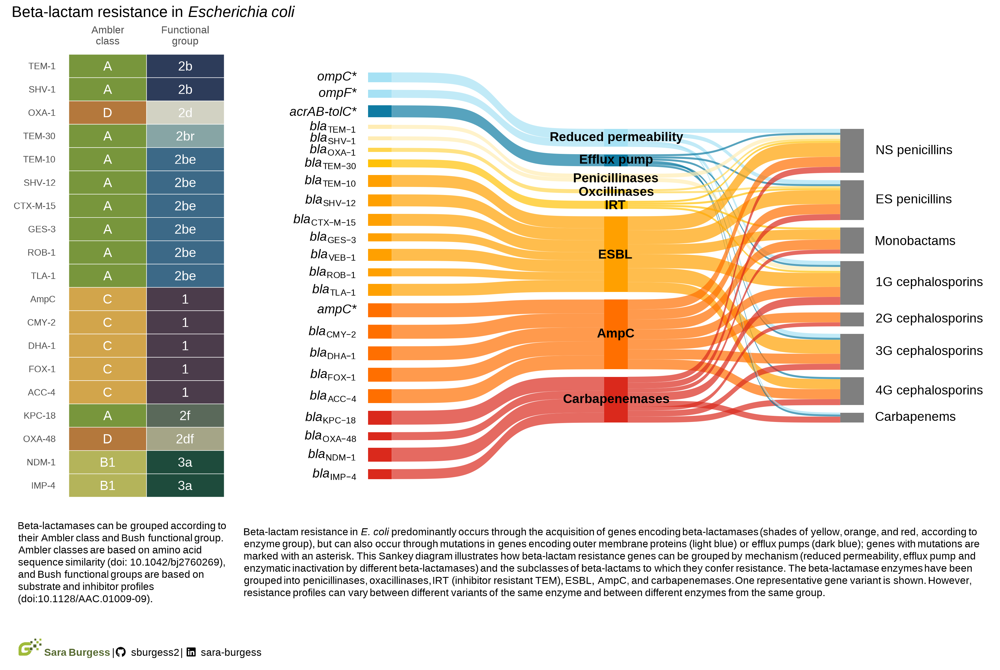

# Generating and Polishing Sankey Diagrams in R

Visualising antimicrobial resistance (AMR) genes in *Escherichia coli* using interactive and static Sankey diagrams built in R.

🌐 **[View the project](https://sburgess2.github.io/sankey_amr/)**  
📖 **[Published on Greenhood Data](https://greenhooddata.co.nz/page-9)**

---

## About

This project grew out of research at Massey University focused on understanding how antibiotic-resistant *E. coli* spreads between humans, animals, and the environment. Keeping track of the different resistance genes across different antibiotic classes can be challenging, so these Sankey diagrams were created as a reference for researchers.

The project demonstrates two approaches to building Sankey diagrams in R:

**Diagram 1 — Interactive Sankey (`networkD3`):** Visualises resistance genes and mechanisms across six antibiotic classes (aminoglycosides, fluoroquinolones, tetracyclines, phenicols, sulfonamides and trimethoprim, and nitrofurans), with links coloured by antibiotic class.

**Diagram 2 — Static Sankey (`ggsankey`):** Visualises beta-lactam resistance genes, grouped by enzyme type (penicillinases, oxacillinases, IRT, ESBL, AmpC, and carbapenemases) and mapped to beta-lactam subclasses.

Data was manually sourced from published literature (see References in the blog).

---

## Built with

**R packages:**

| Package | Purpose |
|---------|---------|
| `networkD3` | Interactive Sankey diagram |
| `htmlwidgets` | Customising and saving the interactive widget |
| `webshot2` | Saving the HTML widget as a PNG |
| `ggsankey` | Static Sankey diagram (ggplot2 extension) |
| `tidyverse` | Data wrangling |
| `paletteer` | Colour palette selection |
| `patchwork` | Combining multiple plots |
| `ggtext` | Text rendering in ggplot2 |
| `showtext` / `sysfonts` | Custom fonts |
| `glue` | Glue together strings |

---

## Citation

Burgess, Sara. 2025. "Generating and polishing Sankey diagrams in R." 14 November 2025. https://sburgess2.github.io/sankey_amr/

